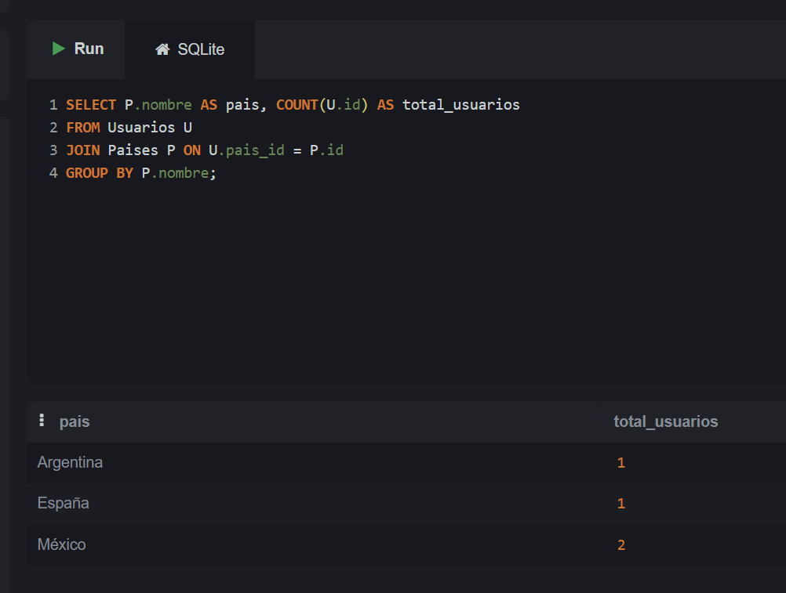
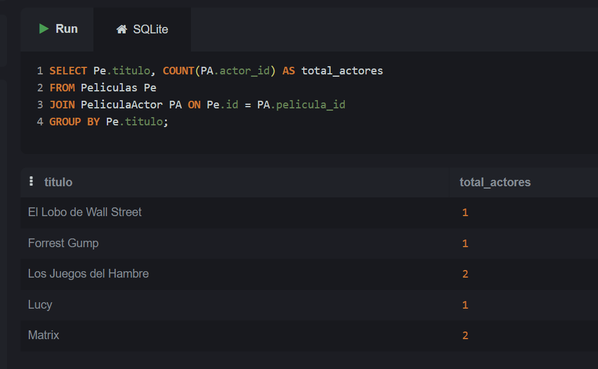
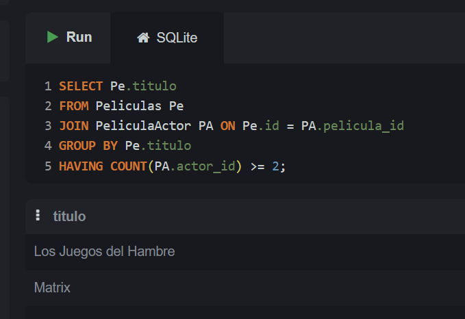
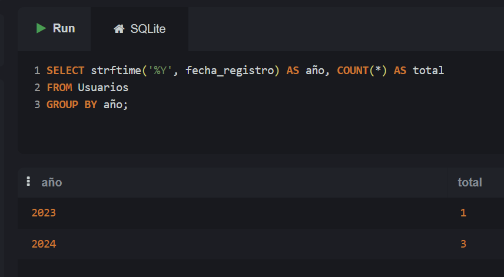
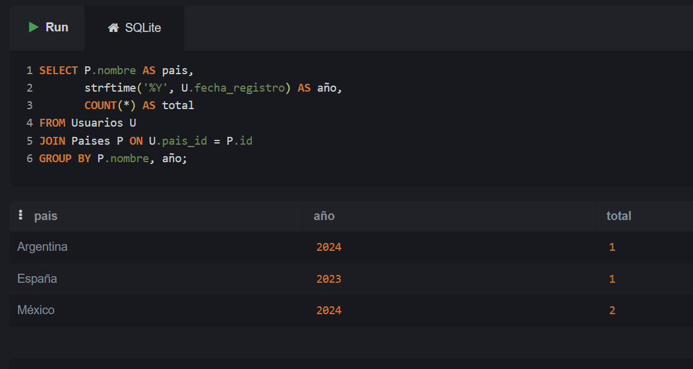
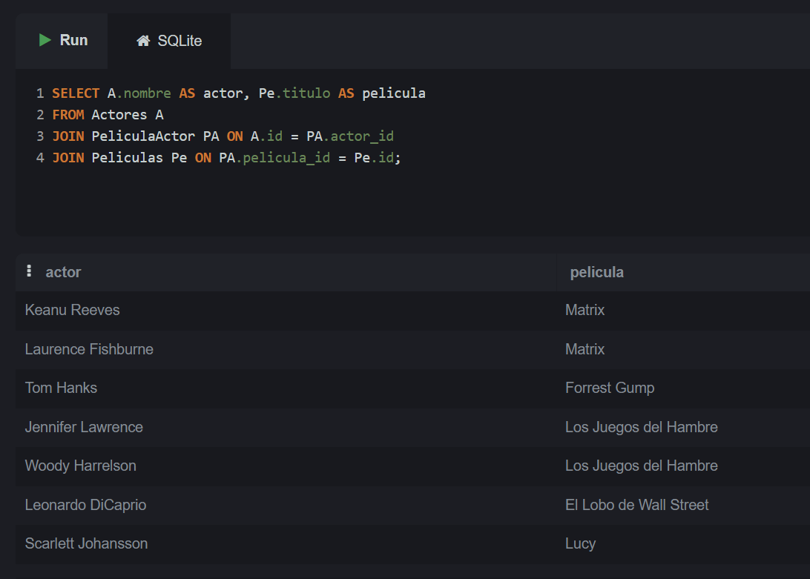
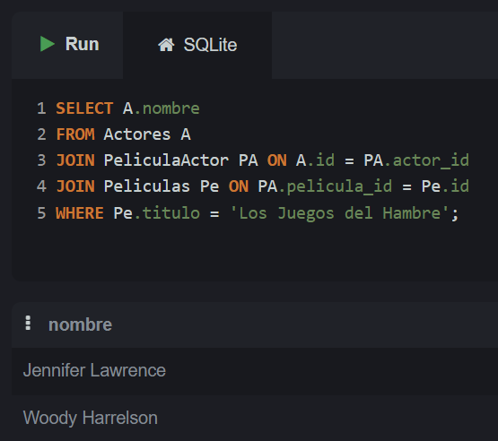
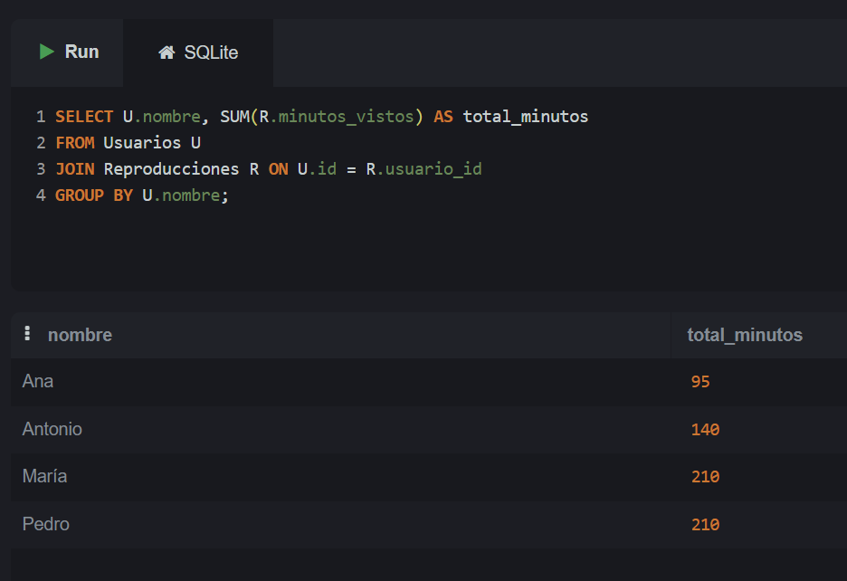
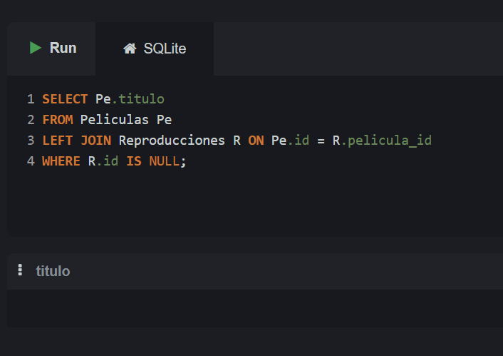
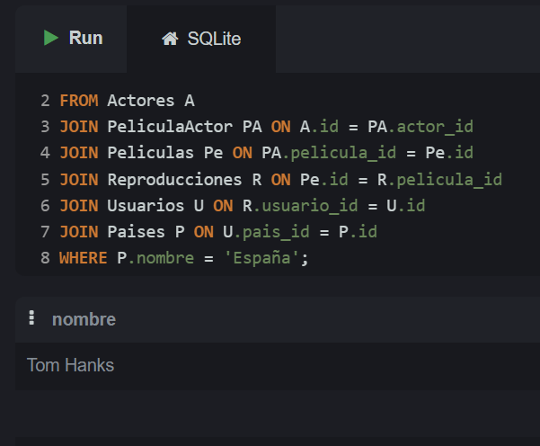

SELECT P.nombre AS pais, COUNT(U.id) AS total_usuarios
FROM Usuarios U
JOIN Paises P ON U.pais_id = P.id
GROUP BY P.nombre;

SELECT Pe.titulo, COUNT(PA.actor_id) AS total_actores
FROM Peliculas Pe
JOIN PeliculaActor PA ON Pe.id = PA.pelicula_id
GROUP BY Pe.titulo;

SELECT Pe.titulo
FROM Peliculas Pe
JOIN PeliculaActor PA ON Pe.id = PA.pelicula_id
GROUP BY Pe.titulo
HAVING COUNT(PA.actor_id) >= 2;

SELECT strftime('%Y', fecha_registro) AS año, COUNT(*) AS total
FROM Usuarios
GROUP BY año;

SELECT P.nombre AS pais,
       strftime('%Y', U.fecha_registro) AS año,
       COUNT(*) AS total
FROM Usuarios U
JOIN Paises P ON U.pais_id = P.id
GROUP BY P.nombre, año;

SELECT A.nombre AS actor, Pe.titulo AS pelicula
FROM Actores A
JOIN PeliculaActor PA ON A.id = PA.actor_id
JOIN Peliculas Pe ON PA.pelicula_id = Pe.id;

SELECT A.nombre
FROM Actores A
JOIN PeliculaActor PA ON A.id = PA.actor_id
JOIN Peliculas Pe ON PA.pelicula_id = Pe.id
WHERE Pe.titulo = 'Los Juegos del Hambre';

SELECT U.nombre, SUM(R.minutos_vistos) AS total_minutos
FROM Usuarios U
JOIN Reproducciones R ON U.id = R.usuario_id
GROUP BY U.nombre;

SELECT Pe.titulo
FROM Peliculas Pe
LEFT JOIN Reproducciones R ON Pe.id = R.pelicula_id
WHERE R.id IS NULL;

SELECT DISTINCT A.nombre
FROM Actores A
JOIN PeliculaActor PA ON A.id = PA.actor_id
JOIN Peliculas Pe ON PA.pelicula_id = Pe.id
JOIN Reproducciones R ON Pe.id = R.pelicula_id
JOIN Usuarios U ON R.usuario_id = U.id
JOIN Paises P ON U.pais_id = P.id
WHERE P.nombre = 'España';

